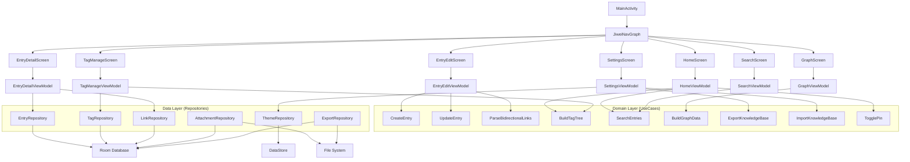
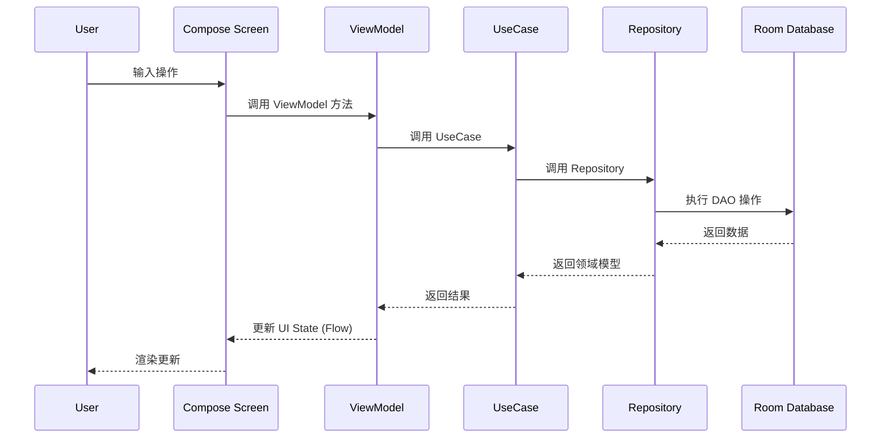

# 积微 (Jiwei) — 系统架构

## 概述

积微 (Jiwei) 是一款 Android 原生本地知识库应用，由 Kotlin + Jetpack Compose 构建，采用 MVVM + Clean Architecture 三层架构。所有数据存储于本地 Room 数据库，支持导出为标准 Markdown + JSON 格式的 ZIP 备份文件。

系统的核心价值是帮助用户随手记录碎片知识，通过标签层级分类、双向链接关联、全文搜索和卡片式浏览，将零散信息逐步构建为个人知识体系。应用名取自《荀子》"积微者著"。

## 技术栈

**语言与运行时**
- Kotlin 2.0.0
- JVM 17 (Android)

**框架**
- Jetpack Compose + Material 3 (UI)
- Room (本地数据库，含 FTS4 全文搜索)
- Hilt (依赖注入)
- Navigation Compose (路由导航)
- DataStore Preferences (偏好存储)
- Coil (图片加载)

**数据存储**
- Room / SQLite (主数据库)
- 应用私有目录 (附件文件)
- ZIP 格式 (数据导出/导入)

**平台**
- Android (minSdk 26, targetSdk 34)

## 项目结构

```
workspace/
├── app/
│   ├── build.gradle.kts              # 模块构建配置
│   ├── src/main/
│   │   ├── AndroidManifest.xml
│   │   ├── java/com/jiwei/app/
│   │   │   ├── JiweiApplication.kt   # Application 入口
│   │   │   ├── MainActivity.kt       # 唯一 Activity
│   │   │   ├── di/                   # Hilt 依赖注入模块
│   │   │   │   ├── AppModule.kt
│   │   │   │   └── RepositoryModule.kt
│   │   │   ├── navigation/           # 路由定义
│   │   │   │   ├── Screen.kt
│   │   │   │   └── JiweiNavGraph.kt
│   │   │   ├── data/                 # 数据层
│   │   │   │   ├── local/            # Room 数据库相关
│   │   │   │   │   ├── db/           # Database 类
│   │   │   │   │   ├── dao/          # DAO 接口
│   │   │   │   │   ├── entity/       # Entity 类
│   │   │   │   │   └── converter/    # TypeConverter
│   │   │   │   └── repository/       # Repository 实现
│   │   │   ├── domain/               # 领域层
│   │   │   │   ├── model/            # 领域模型
│   │   │   │   │   └── usecase/      # 用例
│   │   │   ├── ui/                   # UI 层
│   │   │   │   └── theme/            # Material 3 主题
│   │   │   └── util/                 # 工具类
│   │   └── res/                      # Android 资源
│   └── proguard-rules.pro
├── build.gradle.kts                  # 项目级构建
├── settings.gradle.kts               # 项目设置
├── gradle/                           # Gradle Wrapper
│   ├── libs.versions.toml            # 版本目录
│   └── wrapper/
├── gradle.properties
└── .monkeycode/                      # 项目文档和规格
    ├── docs/                         # 项目 Wiki
    └── specs/                        # 需求/设计/任务规格
        └── jiwei-knowledge-base/
```

**入口点**
- `app/src/main/AndroidManifest.xml` — Android 清单，声明权限和 Activity
- `com.jiwei.app.JiweiApplication` — Application 类，Hilt 入口
- `com.jiwei.app.MainActivity` — 唯一 Activity，挂载 Compose 内容
- `com.jiwei.app.navigation.JiweiNavGraph` — 路由导航图

## 子系统

### 数据层 (Data Layer)
**目的**: 提供本地持久化能力，包括条目、标签、链接、附件、FTS 搜索索引
**位置**: `app/src/main/java/com/jiwei/app/data/`
**关键文件**: `JiweiDatabase.kt`, 各 DAO 文件, 各 Entity 文件
**依赖**: Room 库, Android 文件系统
**被依赖**: 领域层 (Domain Layer)

### 领域层 (Domain Layer)
**目的**: 封装业务逻辑，提供 UseCase 接口供 ViewModel 调用
**位置**: `app/src/main/java/com/jiwei/app/domain/`
**关键文件**: 各 UseCase 类, 各 Repository 接口
**依赖**: 数据层 Repository
**被依赖**: UI 层 (ViewModel)

### UI 层 (UI Layer)
**目的**: Jetpack Compose 用户界面，包括卡片浏览、条目编辑、知识图谱等
**位置**: `app/src/main/java/com/jiwei/app/ui/`
**关键文件**: `theme/Theme.kt`, 各 Screen 和 ViewModel
**依赖**: 领域层 UseCase, Material 3, Navigation Compose, Coil
**被依赖**: MainActivity

### 依赖注入 (DI)
**目的**: 通过 Hilt 管理对象创建和生命周期
**位置**: `app/src/main/java/com/jiwei/app/di/`
**关键文件**: `AppModule.kt` (数据库、DataStore), `RepositoryModule.kt` (各 Repository)
**依赖**: Hilt, Room
**被依赖**: 所有层

### 导航 (Navigation)
**目的**: 管理应用内页面路由和参数传递
**位置**: `app/src/main/java/com/jiwei/app/navigation/`
**关键文件**: `Screen.kt` (路由定义), `JiweiNavGraph.kt` (导航图)
**依赖**: Navigation Compose
**被依赖**: MainActivity, 各 Screen

## 架构图



## 数据流


