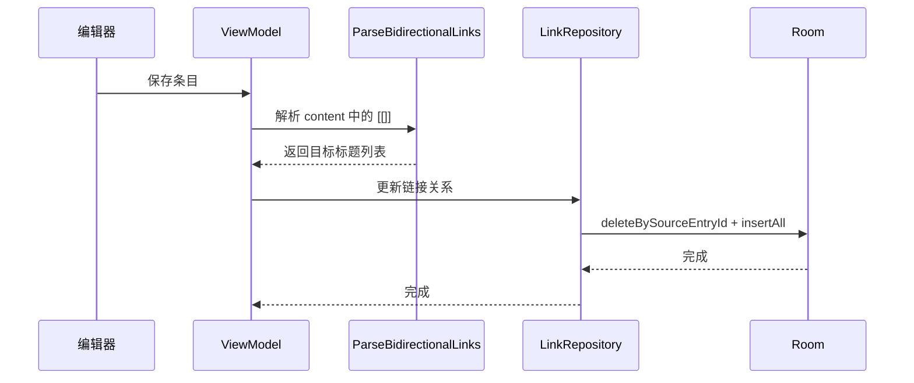

# 双向链接 (Bidirectional Link)

双向链接是知识条目之间通过 `[[条目名称]]` 语法建立的相互引用关系。

## 什么是双向链接？

双向链接允许用户在 Markdown 正文中使用 `[[条目名称]]` 语法引用其他条目。系统在保存条目时自动解析这些引用并建立链接关系，在目标条目中展示"反向链接"（即哪些条目引用了当前条目）。

**关键特征**:
- 语法: `[[目标条目标题]]`
- 保存时自动解析和更新链接关系
- 详情页底部展示反向链接列表
- 点击链接跳转到目标条目
- 引用不存在的条目时提示用户创建

## 代码位置

| 方面 | 位置 |
|------|------|
| Entity | `data/local/entity/EntryLinkEntity.kt` |
| DAO | `data/local/dao/EntryLinkDao.kt` |
| Repository | `data/repository/LinkRepository.kt` |
| UseCase | `domain/usecase/ParseBidirectionalLinks.kt` |
| 解析渲染 | `util/MarkdownParser.kt` (Markdown 实时预览中) |

## 结构

```kotlin
@Entity(
    tableName = "entry_links",
    primaryKeys = ["sourceEntryId", "targetEntryTitle"]
)
data class EntryLinkEntity(
    val sourceEntryId: String,           // 发起链接的条目 ID
    val targetEntryTitle: String         // 被引用条目的标题
)
```

## 不变量

1. **链接一致性**: 每次保存条目时，全量重新解析正文中的 `[[]]`，删除旧链接记录后插入新记录
2. **正向链接**: `sourceEntryId -> targetEntryTitle`（从内容中解析）
3. **反向链接**: 查询 `targetEntryTitle` 匹配的所有 `sourceEntryId`

## 解析规则

正则表达式: `\[\[([^\]]+)\]\]`

- `[[Android开发]]` → 链接到标题为"Android开发"的条目
- `[[编程/Android|Android笔记]]` → 链接到"编程/Android"条目，显示为"Android笔记"
- 未匹配到条目的链接显示为失效链接样式，点击提示创建

## 数据流


