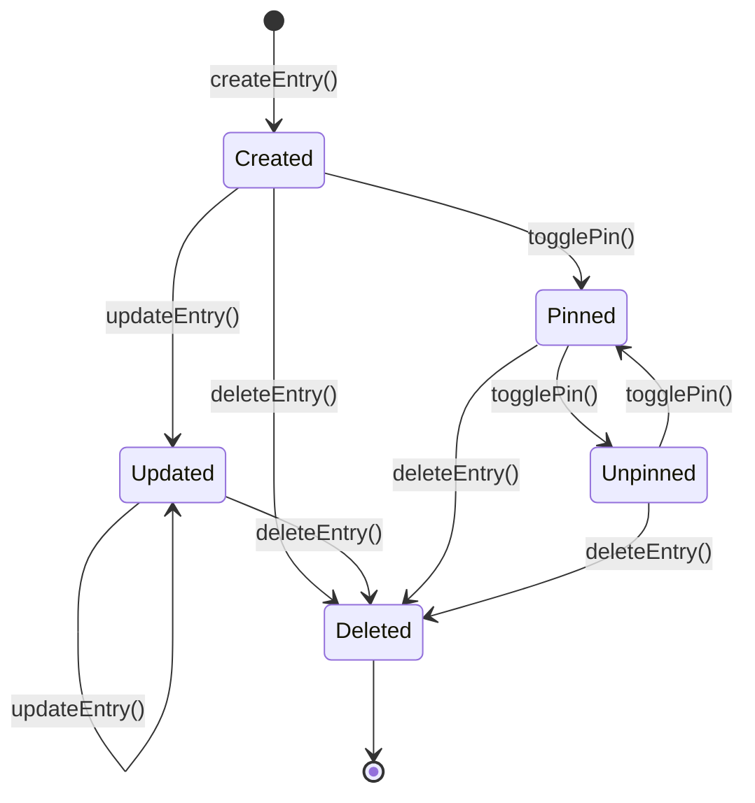
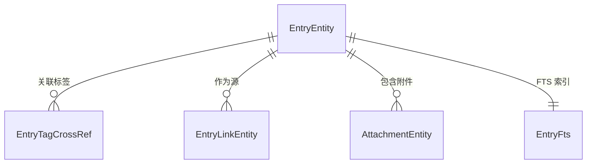

# 知识条目 (Entry)

知识条目是积微系统的核心实体，代表用户记录的一条碎片知识。

## 什么是知识条目？

知识条目代表用户想要保存和整理的任何信息片段，包括标题、Markdown 正文、关联标签、附件和双向链接。系统通过条目的创建、编辑、搜索、关联和可视化浏览，帮助用户将碎片信息构建为知识体系。

**关键特征**:
- 使用 Markdown 格式编写正文，支持实时预览
- 通过标签和双向链接与其他条目关联
- 支持插入图片和文件附件
- 可标记为收藏置顶
- 按修改时间排序，最近活跃的条目靠前

## 代码位置

| 方面 | 位置 |
|------|------|
| Entity | `data/local/entity/EntryEntity.kt` |
| DAO | `data/local/dao/EntryDao.kt` |
| Repository | `data/repository/EntryRepository.kt` |
| UseCase | `domain/usecase/CreateEntry.kt`, `UpdateEntry.kt` |
| ViewModel | `ui/entry/EntryEditViewModel.kt`, `EntryDetailViewModel.kt` |
| Screen | `ui/entry/EntryEditScreen.kt`, `EntryDetailScreen.kt` |

## 结构

```kotlin
@Entity(tableName = "entries")
data class EntryEntity(
    @PrimaryKey val id: String,          // UUID v4
    val title: String,                   // 条目标题
    val content: String,                 // Markdown 原文
    val isPinned: Boolean = false,       // 是否收藏
    val createdAt: Long,                 // 创建时间戳
    val updatedAt: Long                  // 更新时间戳
)
```

### 关键字段

| 字段 | 类型 | 描述 | 约束 |
|------|------|------|------|
| `id` | `String` | 唯一标识 | UUID v4, 不可变 |
| `title` | `String` | 条目标题 | 不可为空 |
| `content` | `String` | Markdown 正文 | 支持 `[[]]` 双向链接语法 |
| `isPinned` | `Boolean` | 收藏置顶标记 | 默认 false |
| `updatedAt` | `Long` | 更新时间戳 | 每次保存时自动更新 |

## 不变量

1. **ID 唯一性**: 每个条目有唯一的 UUID，通过 Room PrimaryKey 约束
2. **双向链接一致性**: 每次保存条目时，重新解析 `content` 中的 `[[]]` 语法，全量更新 `EntryLinkEntity` 表
3. **FTS 索引同步**: 每次 INSERT/UPDATE 时，Room FTS4 `contentEntity` 自动同步 `entries_fts` 虚拟表
4. **附件级联删除**: 删除条目时，通过 ForeignKey CASCADE 自动删除关联附件记录

## 生命周期



## 关系


