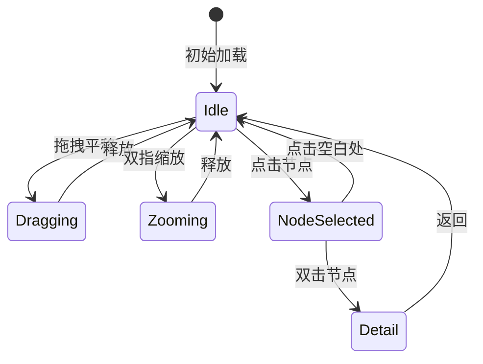

# 知识图谱 (Knowledge Graph)

知识图谱以节点和连线可视化展示知识条目之间的双向链接关系。

## 什么是知识图谱？

知识图谱将条目之间的双向链接关系转化为可视化网络：每个节点代表一个知识条目，每条连线代表一个链接关系。用户可以通过拖拽、缩放探索知识网络，发现条目间的隐式关联。

**关键特征**:
- 节点表示条目，连线表示链接关系
- 力导向布局算法自动排列节点
- 支持双指缩放和拖拽平移
- 点击节点高亮相邻关联
- 双击节点跳转到详情页

## 代码位置

| 方面 | 位置 |
|------|------|
| 数据模型 | `domain/model/GraphData.kt` |
| UseCase | `domain/usecase/BuildGraphData.kt` |
| ViewModel | `ui/graph/GraphViewModel.kt` |
| Screen | `ui/graph/GraphScreen.kt` |

## 结构

```kotlin
data class GraphNode(
    val entryId: String,
    val title: String,
    val x: Float,                        // 布局计算后的 X 坐标
    val y: Float                         // 布局计算后的 Y 坐标
)

data class GraphEdge(
    val sourceId: String,
    val targetId: String
)

data class GraphData(
    val nodes: List<GraphNode>,
    val edges: List<GraphEdge>
)
```

## 力导向布局算法

1. **初始化**: 所有节点随机分布在画布上
2. **迭代计算**:
   - 库仑斥力: 每对节点间施加与距离平方成反比的推力
   - 胡克引力: 每条连线两端节点间施加与距离成正比的拉力
   - 更新位置: 根据合力移动节点
3. **收敛条件**: 节点位移小于阈值或达到最大迭代次数

## 不变量

1. **节点唯一性**: 每个条目在图谱中仅出现一次
2. **边一致性**: 只有存在链接关系的节点间才有连线
3. **孤立节点**: 无任何链接的条目不出现在图谱中

## 交互行为


