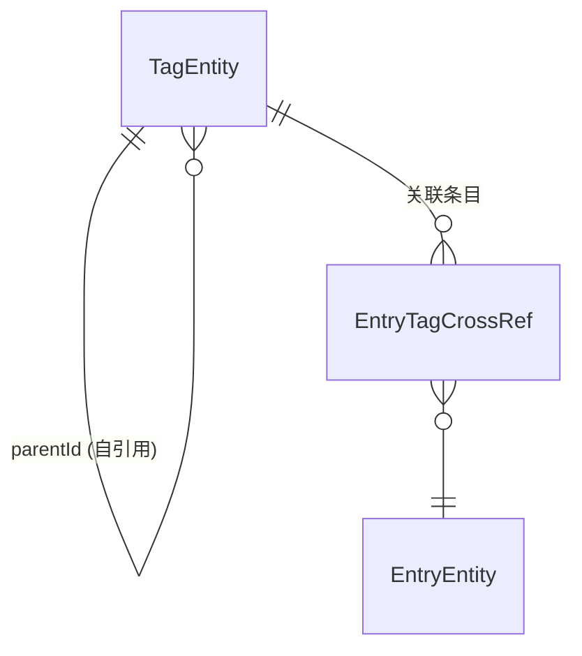

# 标签 (Tag)

标签是知识条目的分类体系，支持以 `/` 分隔符创建的层级结构。

## 什么是标签？

标签代表用户为知识条目分配的分类标识。与扁平标签不同，积微支持通过 `/` 分隔符创建嵌套层级（如"编程/Android/Kotlin"），从而构建树形分类体系。

**关键特征**:
- 以 `/` 分隔符表示层级关系
- 通过 `parentId` 自引用字段存储层级结构
- 一个条目可关联多个标签
- 点击父标签时自动展示所有子孙标签下的条目
- 在编辑界面提供自动补全建议

## 代码位置

| 方面 | 位置 |
|------|------|
| Entity | `data/local/entity/TagEntity.kt` |
| 交叉表 | `data/local/entity/EntryTagCrossRef.kt` |
| DAO | `data/local/dao/TagDao.kt` |
| Repository | `data/repository/TagRepository.kt` |
| UseCase | `domain/usecase/BuildTagTree.kt` |
| ViewModel | `ui/tag/TagManageViewModel.kt` |
| Screen | `ui/tag/TagManageScreen.kt` |

## 结构

```kotlin
@Entity(tableName = "tags")
data class TagEntity(
    @PrimaryKey val id: String,          // UUID v4
    val name: String,                    // 标签名（不含父路径）
    val parentId: String? = null         // 父标签 ID
)
```

### 关键字段

| 字段 | 类型 | 描述 | 约束 |
|------|------|------|------|
| `id` | `String` | 唯一标识 | UUID v4 |
| `name` | `String` | 标签显示名 | 仅存储末级名称，不含 `/` 路径 |
| `parentId` | `String?` | 父标签 ID | null 表示根标签 |

## 不变量

1. **完整路径唯一性**: 从根到叶的完整路径（如"编程/Android"）不能重复
2. **无循环引用**: `parentId` 不能形成环
3. **子标签级联展示**: 查询某个标签的条目时，必须同时包含其所有子孙标签关联的条目

## 标签树结构

```
编程
├── Android
│   ├── Kotlin
│   └── Jetpack Compose
├── Python
│   ├── Django
│   └── FastAPI
└── Rust
设计
├── UI
└── UX
```

## 关系


