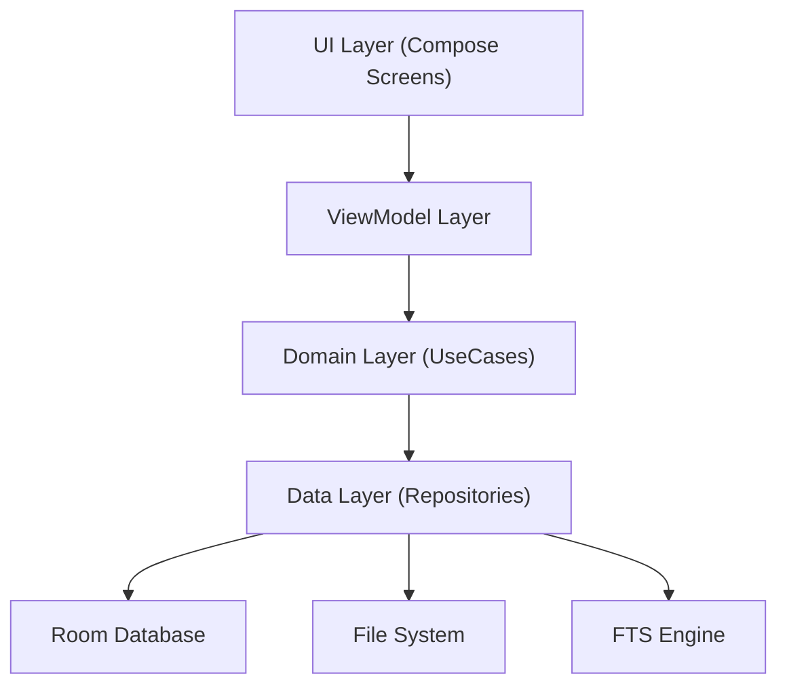
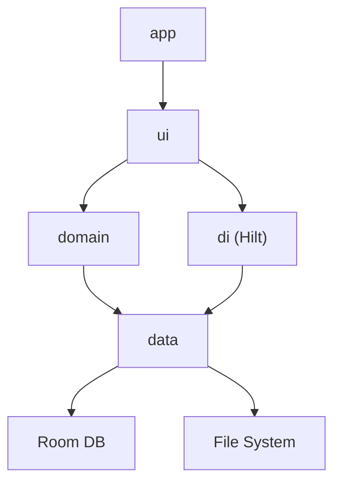
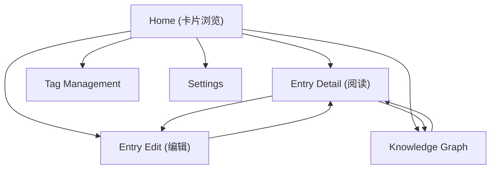

# 积微 (Jiwei) — 技术设计文档

Feature Name: jiwei-knowledge-base
Updated: 2026-07-23

## Description

积微是一款 Android 原生本地知识库应用，采用 Kotlin + Jetpack Compose 构建，基于 MVVM 架构模式，使用 Room 作为本地数据库。核心设计目标：轻量（纯本地）、流畅（Compose 原生渲染）、可迁移（标准 Markdown + JSON 导出格式）。

## Architecture

### 分层架构



### 模块依赖



## Components and Interfaces

### 1. Data Layer

#### Room Entities

```kotlin
// EntryEntity.kt
@Entity(tableName = "entries")
data class EntryEntity(
    @PrimaryKey val id: String,          // UUID
    val title: String,
    val content: String,                 // Markdown 原文
    val isPinned: Boolean = false,
    val createdAt: Long,
    val updatedAt: Long
)

// TagEntity.kt
@Entity(
    tableName = "tags",
    indices = [Index("parentId")]
)
data class TagEntity(
    @PrimaryKey val id: String,
    val name: String,
    val parentId: String? = null         // 层级标签父节点
)

// EntryTagCrossRef.kt
@Entity(
    tableName = "entry_tag_cross_ref",
    primaryKeys = ["entryId", "tagId"],
    indices = [Index("tagId")]
)
data class EntryTagCrossRef(
    val entryId: String,
    val tagId: String
)

// EntryLinkEntity.kt
@Entity(
    tableName = "entry_links",
    primaryKeys = ["sourceEntryId", "targetEntryTitle"],
    indices = [Index("targetEntryTitle")]
)
data class EntryLinkEntity(
    val sourceEntryId: String,
    val targetEntryTitle: String
)

// AttachmentEntity.kt
@Entity(
    tableName = "attachments",
    foreignKeys = [ForeignKey(
        entity = EntryEntity::class,
        parentColumns = ["id"],
        childColumns = ["entryId"],
        onDelete = ForeignKey.CASCADE
    )]
)
data class AttachmentEntity(
    @PrimaryKey val id: String,
    val entryId: String,
    val fileName: String,
    val filePath: String,                // 应用私有目录下的相对路径
    val mimeType: String,
    val fileSize: Long,
    val createdAt: Long
)
```

#### FTS 搜索表

```kotlin
// EntryFts.kt — Room FTS4 虚拟表
@Fts4(contentEntity = EntryEntity::class)
@Entity(tableName = "entries_fts")
data class EntryFts(
    val title: String,
    val content: String,
    val tagNames: String                 // 逗号分隔的标签名，用于搜索
)
```

#### DAOs

| DAO | 核心方法 |
|-----|---------|
| `EntryDao` | `insert`, `update`, `delete`, `getById`, `getAllFlow`, `getPinnedFlow`, `searchFlow` |
| `TagDao` | `insert`, `delete`, `getAll`, `getChildren`, `getEntriesByTag` |
| `EntryTagDao` | `insertCrossRef`, `deleteCrossRef`, `getTagsForEntry`, `getEntriesForTag` |
| `EntryLinkDao` | `insert`, `delete`, `getBacklinks`, `getAllLinks` |
| `AttachmentDao` | `insert`, `delete`, `getByEntryId` |

#### Repositories

| Repository | 职责 |
|------------|------|
| `EntryRepository` | 条目 CRUD、搜索、排序、收藏状态管理 |
| `TagRepository` | 标签 CRUD、层级查询、自动补全、标签树构建 |
| `LinkRepository` | 双向链接解析、反向链接查询、图谱数据查询 |
| `AttachmentRepository` | 附件文件读写、图片存储、清理 |
| `ExportRepository` | Markdown/JSON 序列化、ZIP 打包、导入解析 |
| `ThemeRepository` | 主题偏好持久化 (DataStore) |

### 2. Domain Layer

#### UseCases

| UseCase | 输入 | 输出 |
|---------|------|------|
| `CreateEntry` | title, content, tags | EntryEntity |
| `UpdateEntry` | id, title, content, tags | EntryEntity |
| `ParseBidirectionalLinks` | content: String | List<String> (目标条目名) |
| `BuildTagTree` | tags: List<TagEntity> | TreeNode |
| `SearchEntries` | query: String | Flow<List<EntryWithTags>> |
| `BuildGraphData` | all entries + links | GraphData (nodes, edges) |
| `ExportKnowledgeBase` | — | File (ZIP) |
| `ImportKnowledgeBase` | File (ZIP) | ImportResult |
| `TogglePin` | entryId: String | EntryEntity |

### 3. UI Layer

#### Navigation Graph



#### Screen 与 ViewModel

| Screen | ViewModel | 核心状态 |
|--------|-----------|---------|
| `HomeScreen` | `HomeViewModel` | entries: Flow, pinnedFilter, tagFilter, sortOrder |
| `EntryDetailScreen` | `EntryDetailViewModel` | entry, backlinks, renderedContent |
| `EntryEditScreen` | `EntryEditViewModel` | title, content, tags, cursorPosition, previewContent |
| `SearchScreen` | `SearchViewModel` | query, results, suggestions |
| `TagManageScreen` | `TagManageViewModel` | tagTree, selectedTag, entriesForTag |
| `GraphScreen` | `GraphViewModel` | nodes, edges, selectedNode, scale, offset |
| `SettingsScreen` | `SettingsViewModel` | isDarkMode, exportProgress, importProgress |

#### Markdown 实时预览实现

采用 Obsidian 风格：同一编辑器内输入后即时渲染。

- 使用 `BasicTextField` + `AnnotatedString` 实现富文本编辑区
- 监听 `TextFieldValue.selection`，光标所在段落保持源码，其余段落即时转换为 `AnnotatedString` 渲染
- 解析器采用增量解析策略：仅重新解析发生变化的段落
- 支持的语法：标题 (H1-H6)、加粗、斜体、行内代码、代码块、列表、引用、链接、`[[]]` 双向链接

### 4. DI Module (Hilt)

```kotlin
@Module
@InstallIn(SingletonComponent::class)
object AppModule {
    @Provides @Singleton
    fun provideDatabase(@ApplicationContext ctx: Context): JiweiDatabase

    @Provides fun provideEntryDao(db: JiweiDatabase): EntryDao
    @Provides fun provideTagDao(db: JiweiDatabase): TagDao
    // ... 其他 DAO
}

@Module
@InstallIn(SingletonComponent::class)
object RepositoryModule {
    @Provides @Singleton
    fun provideEntryRepository(dao: EntryDao, ...): EntryRepository
    // ... 其他 Repository
}
```

## Data Models

### 核心数据关系

```mermaid
erDiagram
    EntryEntity {
        string id PK
        string title
        string content
        boolean isPinned
        long createdAt
        long updatedAt
    }
    TagEntity {
        string id PK
        string name
        string parentId FK
    }
    EntryTagCrossRef {
        string entryId PK_FK
        string tagId PK_FK
    }
    EntryLinkEntity {
        string sourceEntryId PK_FK
        string targetEntryTitle PK
    }
    AttachmentEntity {
        string id PK
        string entryId FK
        string fileName
        string filePath
        string mimeType
        long fileSize
        long createdAt
    }
    EntryEntity ||--o{ EntryTagCrossRef : ""
    EntryEntity ||--o{ EntryLinkEntity : ""
    EntryEntity ||--o{ AttachmentEntity : ""
    TagEntity ||--o{ EntryTagCrossRef : ""
    TagEntity ||--o{ TagEntity : "parentId"
```

### 导出数据格式

```
knowledge_base_export.zip
├── entries/
│   ├── entry-uuid-1.md
│   ├── entry-uuid-2.md
│   └── ...
├── attachments/
│   ├── image-1.png
│   └── ...
└── metadata.json
```

`metadata.json` 结构：
```json
{
  "version": 1,
  "exportedAt": "2026-07-23T10:00:00Z",
  "entries": [
    {
      "id": "uuid",
      "title": "条目标题",
      "file": "entries/uuid.md",
      "tags": ["编程/Android", "Kotlin"],
      "isPinned": false,
      "createdAt": 1234567890,
      "updatedAt": 1234567890
    }
  ],
  "links": [
    { "sourceEntryId": "uuid-1", "targetEntryTitle": "目标条目名" }
  ]
}
```

## Correctness Properties

| 属性 | 约束 |
|------|------|
| 条目 ID 唯一性 | UUID v4，Room PrimaryKey 约束 |
| 标签名唯一性 | 完整路径（含层级）唯一，例如"编程/Android"不能重复 |
| 附件级联删除 | 删除条目时，通过 Room ForeignKey CASCADE 联动删除附件记录；文件由 AttachmentRepository 同步清理 |
| 双向链接一致性 | 每次保存条目时重新解析 `[[]]` 语法，全量更新 EntryLinkEntity 表 |
| 搜索索引同步 | 每次条目 INSERT/UPDATE 时同步更新 FTS 虚拟表 |
| 导入冲突策略 | 以条目 UUID 为判断依据，已存在则提示覆盖或跳过 |

## Error Handling

| 场景 | 处理策略 |
|------|---------|
| Room 数据库操作失败 | ViewModel 捕获异常，通过 `UiState.Error` 向 UI 层传递用户可读提示 |
| 文件系统读写失败（附件） | 显示 Toast 提示，不阻塞条目保存（附件失败不影响文本） |
| 导入 ZIP 格式无效 | 解析前校验，无效时弹出错误提示并中止导入 |
| 导出磁盘空间不足 | 捕获 IOException，提示用户清理空间 |
| Markdown 解析异常 | 容错处理：无法解析的语法保持源码原样显示 |

## Test Strategy

| 测试类型 | 范围 | 工具 |
|---------|------|------|
| 单元测试 | Repository、UseCase、Markdown 解析器、双向链接解析器、标签树构建 | JUnit 5 + MockK |
| DAO 测试 | Room DAO 查询、FTS 搜索正确性 | Room 内存数据库 + 插桩测试 |
| ViewModel 测试 | 状态管理、数据流 | JUnit + Turbine (Flow 测试) |
| UI 测试 | 关键用户流程（新建条目、搜索、标签筛选、导出导入） | Compose UI Test |
| 快照测试 | 卡片组件、Markdown 渲染效果、深色/浅色主题 | Paparazzi |

目标覆盖率：核心 Domain 和 Data 层 > 80%

## References

技术选型参考：
- Room Database: Android 官方持久化库，支持 FTS、Flow、Coroutines
- Jetpack Compose: Android 原生声明式 UI 框架
- Hilt: Android 官方 DI 框架，基于 Dagger
- Kotlin Coroutines + Flow: 异步和响应式数据流
